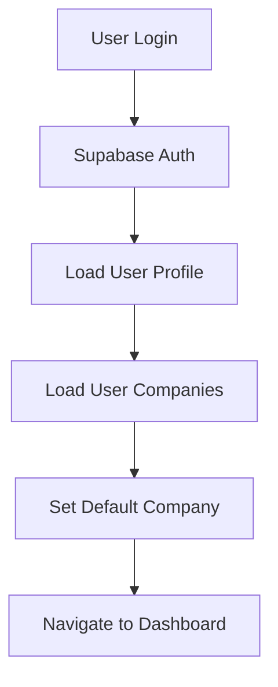

# Cap Table Management Platform - Integration Setup Guide

## Overview

This guide covers the complete setup for integrating the Cap Table Management Platform with Supabase for production-ready authentication and data management.

## Prerequisites

- Node.js 18+ and npm
- A Supabase project (create at [supabase.com](https://supabase.com))
- Git for version control

## Supabase Project Setup

### 1. Create Supabase Project

1. Go to [supabase.com](https://supabase.com) and create a new project
2. Note your project URL and anon key from Settings > API
3. In the SQL Editor, run the schema from `/supabase/schema.sql`

### 2. Configure Environment Variables

Create a `.env.local` file in the project root:

```env
# Supabase Configuration
VITE_SUPABASE_URL=https://your-project-id.supabase.co
VITE_SUPABASE_ANON_KEY=your-anon-key-here

# Development Settings
VITE_NODE_ENV=development
```

### 3. Database Schema Setup

The schema in `/supabase/schema.sql` includes:

- **Companies**: Company information and settings
- **People**: Individual person records
- **Stakeholders**: Company stakeholder relationships
- **Share Classes**: Different types of shares (Common, Preferred)
- **Securities**: Individual securities holdings
- **Grants**: Option grants with vesting schedules
- **Vesting Schedules**: Vesting terms and conditions
- **Rounds**: Funding rounds and investments
- **Transactions**: Audit trail for all changes
- **Audit Events**: Detailed audit logging
- **Role Assignments**: User permissions and access control

### 4. Row Level Security (RLS) Configuration

The schema includes basic RLS policies that ensure users can only access companies they have roles in. Key policies:

```sql
-- Users can only access companies they have roles in
CREATE POLICY "Users can access their companies" ON companies
  FOR ALL USING (
    id IN (
      SELECT company_id FROM role_assignments 
      WHERE person_id IN (
        SELECT id FROM people WHERE email = auth.email()
      )
    )
  );
```

## Authentication Integration

### Current Auth Setup

The authentication system is ready for production with:

1. **AuthContext**: Manages user state, sessions, and company context
2. **ProtectedRoute**: Protects authenticated routes
3. **Company Context**: Manages company-scoped operations
4. **Service Layer**: Type-safe database operations with error handling

### Authentication Flow



### User Profile Management

After authentication, the system:
1. Creates/updates user profile in the `people` table
2. Loads available companies for the user
3. Sets a default company context
4. Establishes role-based permissions

## Service Layer Architecture

### ServiceResult Pattern

All service methods return a `ServiceResult<T>` type for consistent error handling:

```typescript
type ServiceResult<T> = 
  | { success: true; data: T }
  | { success: false; error: CapTableServiceError }
```

### Company-Scoped Operations

All data operations are automatically scoped to the current company using:

```typescript
const { companyId } = useCompanyContext();
```

### Error Handling

The service layer provides robust error handling:
- Database operation errors
- Validation errors  
- Permission errors
- Network errors

## React Query Integration (Recommended)

For production, integrate React Query for:
- Data caching and synchronization
- Background updates
- Optimistic updates
- Query invalidation

```typescript
// Example implementation
export function useCapTableQuery(companyId: string) {
  return useQuery({
    queryKey: ['capTable', companyId],
    queryFn: async () => {
      const result = await capTableService.getCapTable(companyId);
      if (!result.success) {
        throw new Error(result.error.message);
      }
      return result.data;
    },
  });
}
```

## Real-time Subscriptions

Supabase supports real-time subscriptions for live updates:

```typescript
// Example real-time subscription
export function useRealtimeCapTable(companyId: string) {
  useEffect(() => {
    const subscription = supabase
      .channel(`company:${companyId}`)
      .on(
        'postgres_changes',
        {
          event: '*',
          schema: 'public',
          table: 'securities',
          filter: `company_id=eq.${companyId}`,
        },
        (payload) => {
          // Handle real-time updates
          queryClient.invalidateQueries(['capTable', companyId]);
        }
      )
      .subscribe();

    return () => {
      subscription.unsubscribe();
    };
  }, [companyId]);
}
```

## Development vs Production

### Development Mode
- Uses demo company ID when no company is selected
- Includes additional debugging and logging
- More permissive error handling for development

### Production Mode
- Strict company access controls
- Comprehensive audit logging
- Performance optimizations
- Rate limiting and security measures

## Security Considerations

### Row Level Security
- All tables have RLS enabled
- Users can only access data for companies they have roles in
- Admin users have broader access within their companies

### Data Validation
- Client-side validation for user experience
- Server-side validation via RLS and constraints
- Input sanitization and SQL injection prevention

### Audit Trail
- All data changes are logged in `transactions` and `audit_events`
- Immutable audit records with cryptographic hashes
- User actions tracked with IP and user agent

## Monitoring and Analytics

### Error Tracking
Integrate with services like Sentry for production error tracking:

```typescript
// Error reporting in service layer
catch (error) {
  Sentry.captureException(error);
  return createErrorResult('Operation failed', error);
}
```

### Performance Monitoring
- Database query performance monitoring
- API response time tracking
- User experience metrics

## Migration Strategy

### From Mock Data to Production

1. **Phase 1**: Set up Supabase project and run schema
2. **Phase 2**: Configure environment variables and test connection
3. **Phase 3**: Import existing data using Supabase's data import tools
4. **Phase 4**: Update authentication to use real user accounts
5. **Phase 5**: Enable RLS policies and test permissions
6. **Phase 6**: Deploy to production environment

### Data Import Process

```bash
# Example data import using Supabase CLI
supabase db dump --file=backup.sql
supabase db reset
supabase db push
supabase db seed
```

## Deployment

### Environment Variables
Ensure production environment has:
- `VITE_SUPABASE_URL`
- `VITE_SUPABASE_ANON_KEY`
- Any additional configuration variables

### Database Migrations
Use Supabase migrations for schema changes:

```bash
supabase migration new add_new_feature
# Edit the migration file
supabase db push
```

## Support and Troubleshooting

### Common Issues

1. **Type Errors**: Ensure database types are properly generated
2. **RLS Policies**: Verify users have proper role assignments
3. **Performance**: Add indexes for frequently queried columns
4. **Real-time**: Check subscription filters and permissions

### Debugging

```typescript
// Enable debug logging
const supabase = createClient(url, key, {
  global: {
    headers: {
      'X-Client-Info': 'cap-table-management@1.0.0',
    },
  },
  // Enable debug logs
  debug: process.env.NODE_ENV === 'development',
});
```

### Performance Optimization

- Use proper indexes on foreign keys and query columns
- Implement pagination for large datasets
- Use real-time subscriptions judiciously
- Cache frequently accessed data with React Query

## Next Steps

1. Set up your Supabase project
2. Configure environment variables
3. Run the database schema
4. Test authentication flow
5. Import sample data for testing
6. Configure RLS policies for your use case
7. Deploy to production

For questions or issues, refer to the main documentation or create an issue in the project repository.